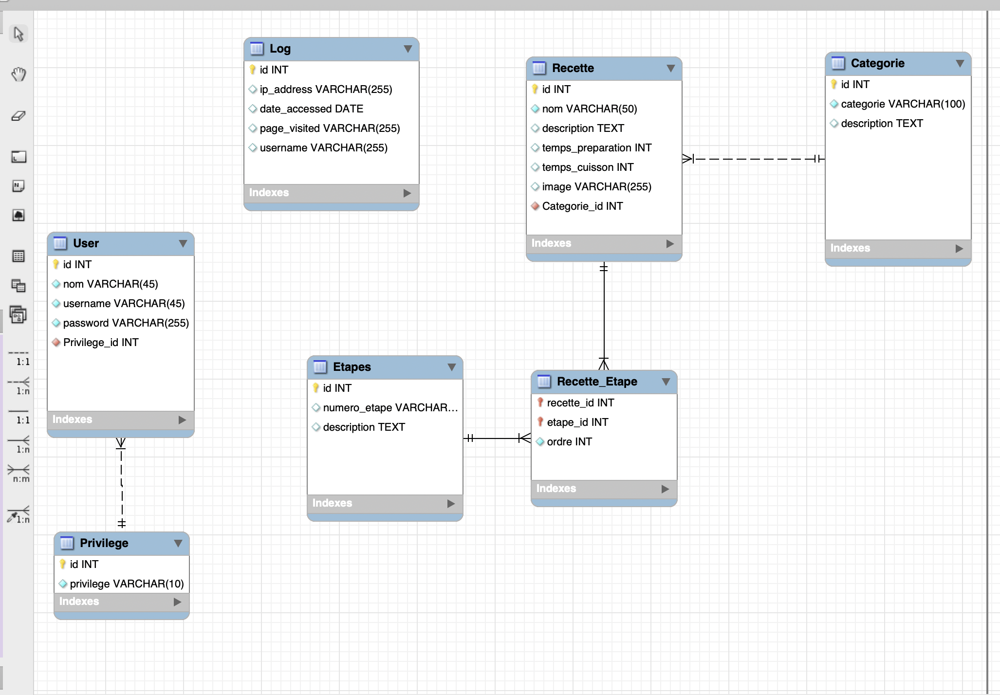

# Catalogue de recettes

C'est un site internet où je peux créer des recettes et les associer à des catégories.
Je pourrais effectuer des receherches par categorie pour faciliter les recherches.

[Demo sur WebDev](https://e2395321.webdev.cmaisonneuve.qc.ca/TP3_Recette)

## Installation

Pour créer les tables du projet, veuillez exécuter le script `recette.sql`.

## Utilisateurs

- nana@gmail.com / 123456789 - Rôle Admim
- tom@gmail.com / 123456789 - Rôle Staff
